# PNR Flow

This directory contains the physical design (Place and Route) flow for `openMSP430`.
The flow is organized into sequential stages, each in its own `step_*` directory with
its own `scripts/`, `reports/`, and `images/`.

`run_flow.tcl` sources the stage drivers in order:

```tcl
source ./step_1_data_setup/scripts/master.tcl
source ./step_2_floorplanning/scripts/master.tcl
source ./step_3_powerplanning/scripts/master.tcl
source ./step_4_placement/scripts/master.tcl
```

## Flow Structure

Intended stage order:

1. Data Setup — completed
2. Floorplanning — completed
3. Power Planning — completed
4. Placement — completed
5. CTS — pending
6. Routing — pending
7. Finishing — pending

Only Steps 1–4 are currently completed and documented below. Steps 5–7 are reserved for the subsequent stages of the PNR flow.

## Completed Stages

### 1. Data Setup (`step_1_data_setup/`)

Creates the NDM design library from the technology file and reference
libraries, reads parasitic (TLU+) tech data, imports the synthesized
gate-level netlist, applies the post-synthesis SDC, defines the `VDD`/`VSS`
power nets and routing-layer budget, and saves the first checkpoint
(`openMSP430_1_data_setup`).

Design summary (`reports/openMSP430_design_summary.rpt`): ~4362 standard
cells, ~4956 nets, 260 ports, and 2 clocks (`dco_clk`, `lfxt_clk`).
Sanity checks cover the NDM library, netlist linkage, and clocks.


### 2. Floorplanning (`step_2_floorplanning/`)

Opens the Step 1 checkpoint, types the `VDD`/`VSS` nets, sets preferred
routing directions (M1–M7), initializes the floorplan at 0.7 core
utilization with a 10 µm core offset, auto-places I/O pins (`place_pins`),
and runs an initial timing-driven floorplan placement with legalization
followed by a congestion-only global route for early feedback.

Results (`reports/`): utilization ~0.7013 (`utilization.rpt`), 0 legality
violations (`floorplan_legality.rpt`), and minimal early congestion
(2 total overflows, 0.01% of GRCs in `congestion.rpt`).

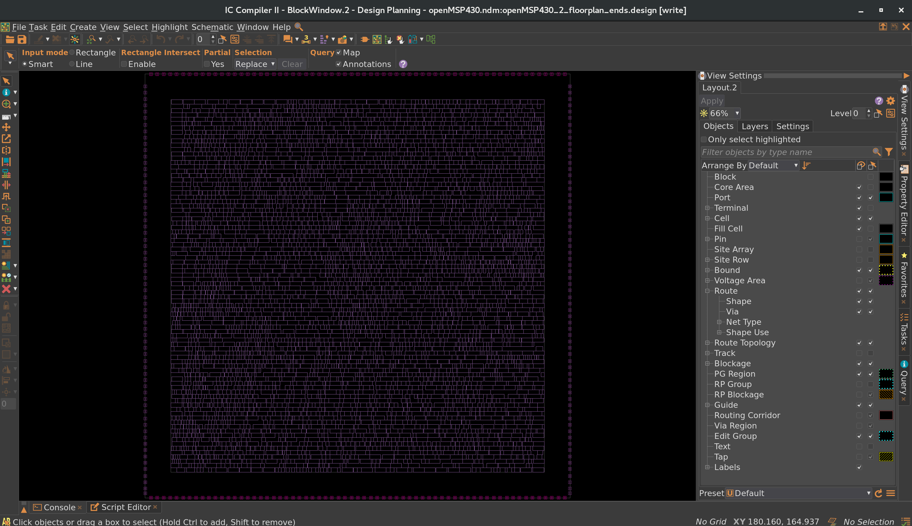

### 3. Power Planning (`step_3_powerplanning/`)

Builds the PG network from the Step 2 checkpoint: M1 standard-cell rails,
an M5 horizontal mesh, M6 vertical and M7 horizontal top meshes, and an
M6/M7 rectangular power ring around the core, then compiles each strategy
and verifies connectivity.

`compile_pg` uses `-ignore_drc` so grid generation can complete through
intermediate violations; the final PG checks in `reports/` are clean:
`pg_drc.rpt` reports no errors, `pg_connectivity.rpt` reports zero floating
wires/vias/cells for both `VDD` and `VSS`, and `pg_missing_vias.rpt`
reports zero missing vias.

PG structure:

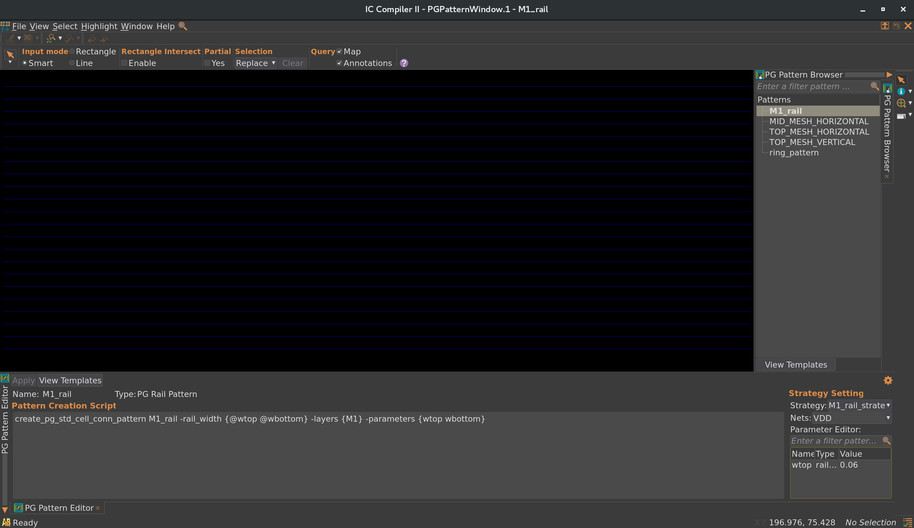

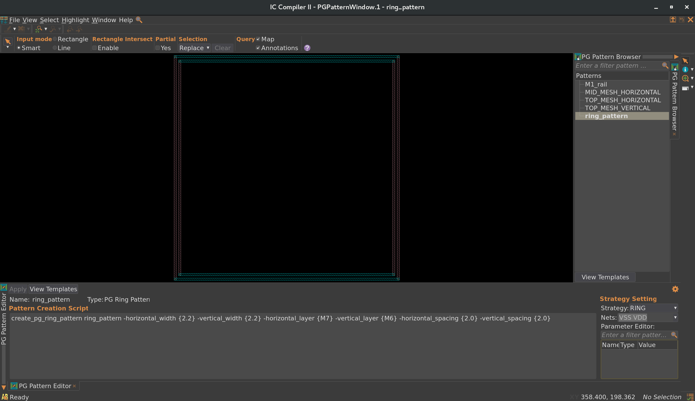

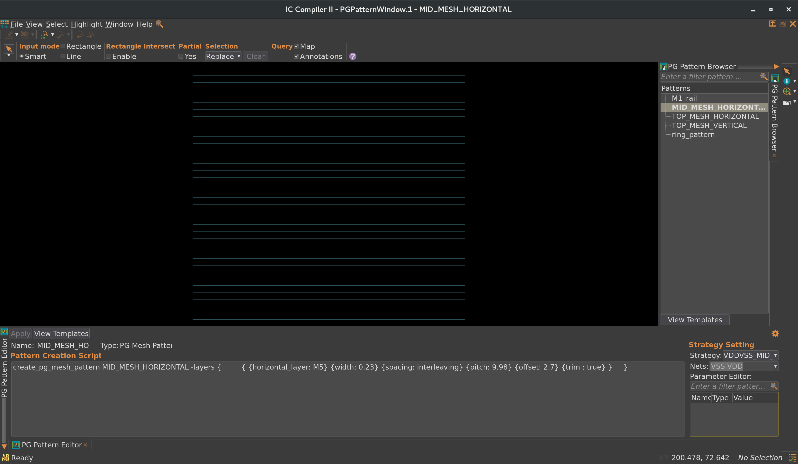

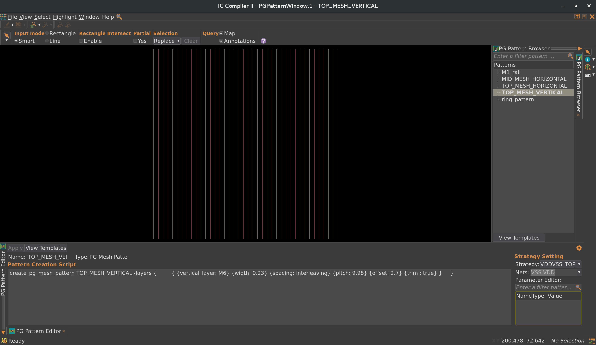

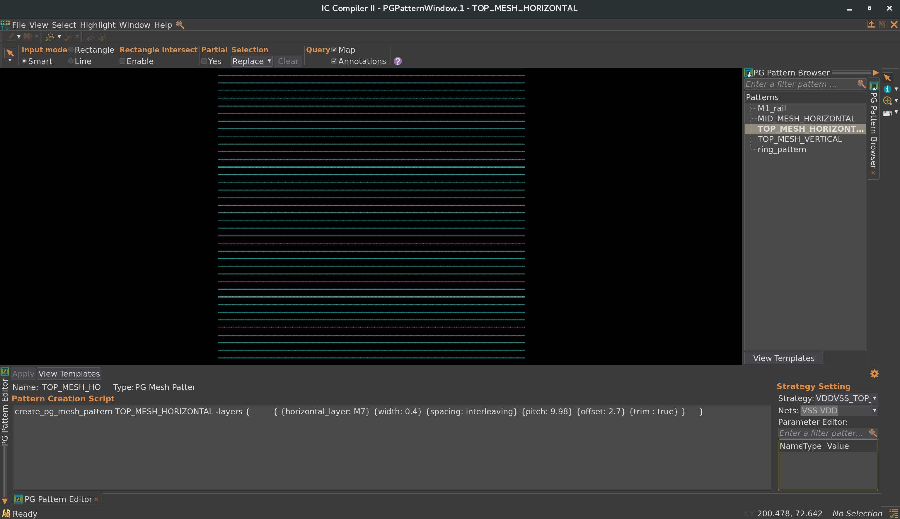

Full grid:

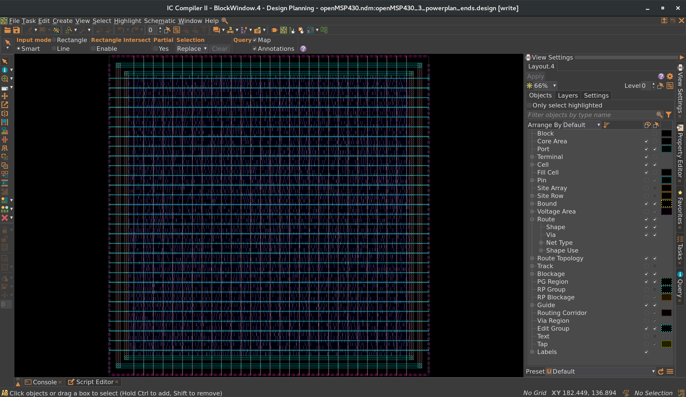

PG patterns and strategies are summarized in `pg_patterns.rpt` and
`pg_strategies.rpt`.

### 4. Placement (`step_4_placement/`)

Opens the Step 3 checkpoint (`openMSP430_3_powerplan_ends` via
`temp_powerplan_ends`), keeps recovery/removal and case-analysis timing
checks enabled, allows coarse placement to continue without scan
definitions (`place.coarse.continue_on_missing_scandef`), sets the
optimizer instance-name prefix to `place`, applies the MCMM setup from
`common/mcmm.tcl`, then runs `place_opt` followed by
`legalize_placement` and saves the `openMSP430_4_place_ends` checkpoint.

Results (`reports/`): `place_legality.rpt` (`check_legality -verbose`)
reports 0 total violations; QoR snapshot
`qor_snapshot/placement.qor` reports 4420 leaf cells, cell area
14894.62, 4876 nets with 0 max-transition/max-capacitance violations,
and 0 total negative slack / 0 violating setup paths in both
`func_slow` and `func_fast` (hold violations remain, e.g. worst hold
-0.04 with 183 `dco_clk` hold violations in `func_fast`); max/min
timing paths are in `timing/placement.max.tim` and
`timing/placement.min.tim`. Library info is in `ndm_lib.rpt`.

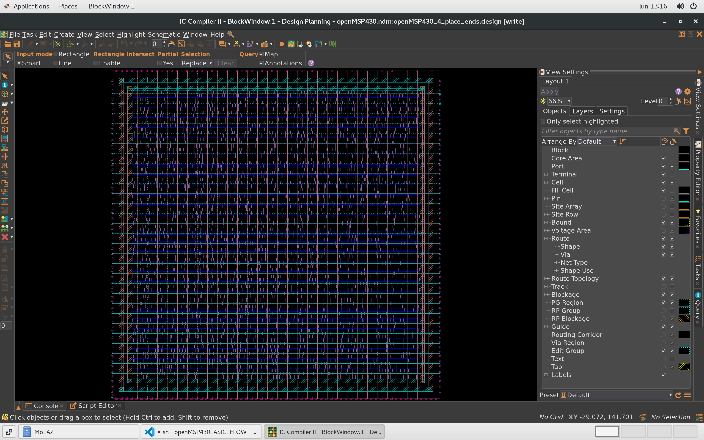

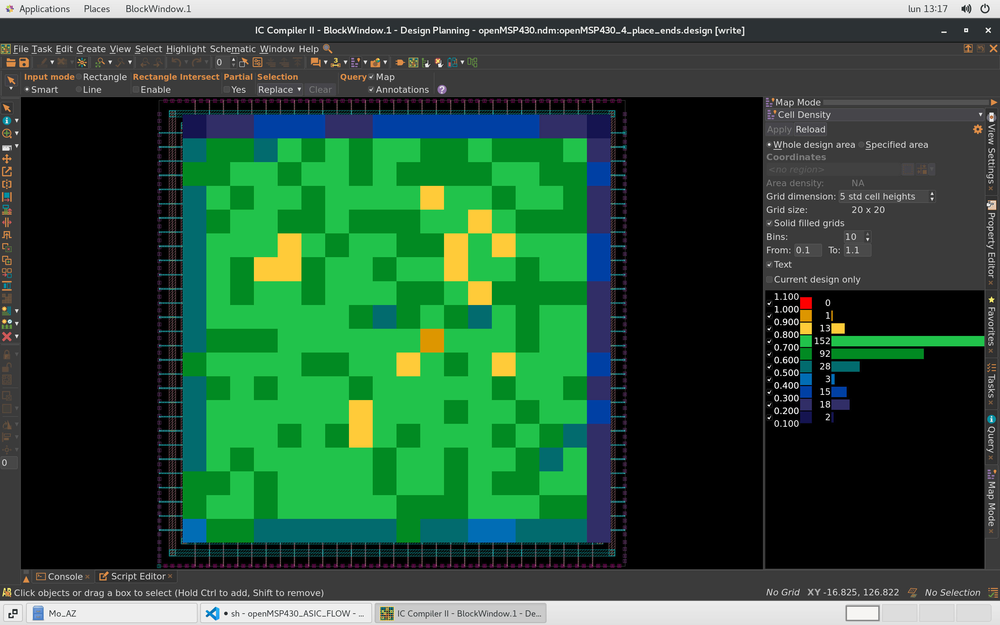

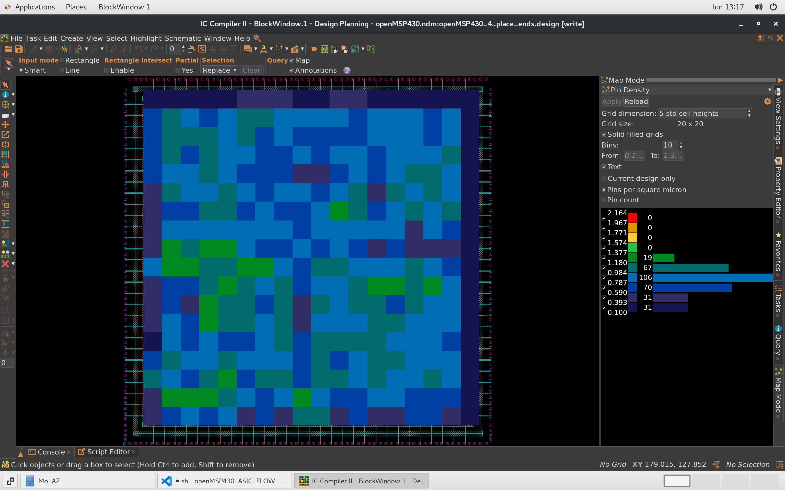

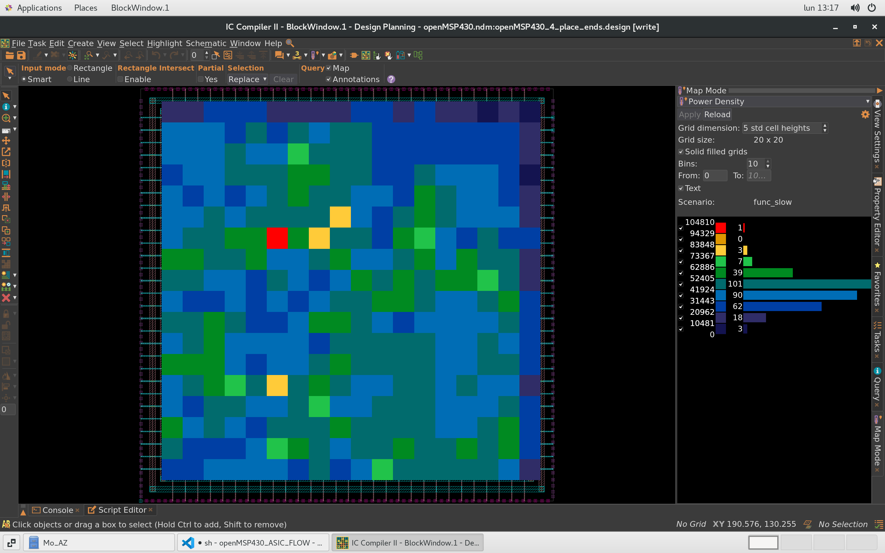

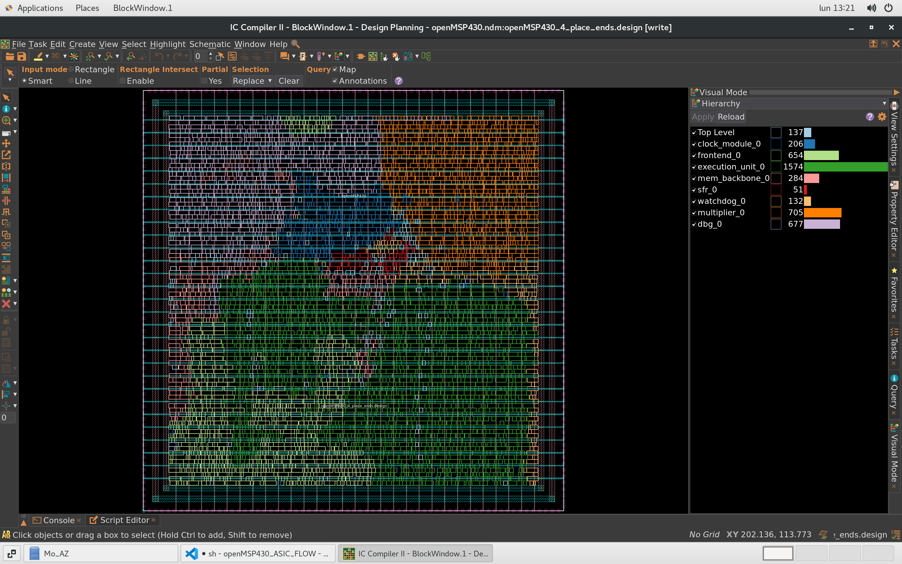

## Directory Organization

Each completed step follows the same layout:

- `scripts/` — stage driver and implementation (`master.tcl`, stage Tcl,
  `variables.tcl`, `checks.tcl`, `reports.tcl`)
- `reports/` — tool-generated checks and summaries for that stage
- `images/` — layout screenshots for that stage

`run_flow.tcl` at the `pnr/` top level launches the stages in
sequence via their `master.tcl` drivers (currently Steps 1–4).

## Pending Stages

Clock Tree Synthesis (CTS), Routing, and Finishing are the
subsequent stages of the flow. They are not yet implemented or documented
in this directory.
