# PNR Flow

This directory contains the physical design (Place and Route) flow for `openMSP430`.
The flow is organized into sequential stages, each in its own `step_*` directory with
its own `scripts/`, `reports/`, and `images/`.

`run_flow.tcl` sources the stage drivers in order:

```tcl
source ./step_1_data_setup/scripts/master.tcl
source ./step_2_floorplanning/scripts/master.tcl
source ./step_3_powerplanning/scripts/master.tcl
source ./step_4_placement/scripts/master.tcl
source ./step_5_cts/scripts/master.tcl
source ./step_5_1_cts_hold_fixing/scripts/master.tcl
source ./step_5_2_elec_fixing/scripts/master.tcl
source ./step_6_routing/scripts/master.tcl
source ./step_6_1_elec_fixing/scripts/master.tcl
source ./step_7_finishing/scripts/master.tcl
```

> **Run Note:** A complete PnR flow was executed from `step_1_data_setup` through `step_7_finishing`. For the stages already present in the repository, the reports from the new run were added while preserving the previous reports for comparison and history. The newly added stages also include their generated reports and outputs. Therefore, reports from the new flow run may share the same or closely related timestamps, as they were generated during the same full-flow execution.

## Flow Structure

Intended stage order:

1. Data Setup — completed
2. Floorplanning — completed
3. Power Planning — completed
4. Placement — completed
5. CTS — completed (`step_5_cts`, `step_5_1_cts_hold_fixing`,
   `step_5_2_elec_fixing`)
6. Routing — completed (`step_6_routing`, `step_6_1_elec_fixing`)
7. Finishing — completed (`step_7_finishing`)

Steps 1–7 are currently completed and documented below.

## Completed Stages

### 1. Data Setup (`step_1_data_setup/`)

Creates the NDM design library from the technology file and reference
libraries, reads parasitic (TLU+) tech data, imports the synthesized
gate-level netlist, applies the post-synthesis SDC, defines the `VDD`/`VSS`
power nets and routing-layer budget, and saves the first checkpoint
(`openMSP430_1_data_setup`).

Design summary (`reports/openMSP430_design_summary.rpt`): ~4362 standard
cells, ~4956 nets, 260 ports, and 2 clocks (`dco_clk`, `lfxt_clk`).
Sanity checks cover the NDM library, netlist linkage, and clocks.

Design setup:
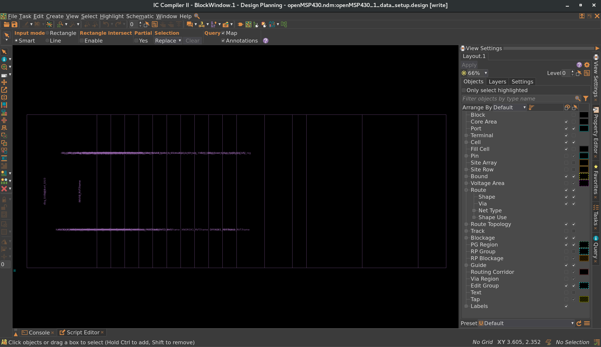

### 2. Floorplanning (`step_2_floorplanning/`)

Opens the Step 1 checkpoint, types the `VDD`/`VSS` nets, sets preferred
routing directions (M1–M7), initializes the floorplan at 0.7 core
utilization with a 10 µm core offset, auto-places I/O pins (`place_pins`),
and runs an initial timing-driven floorplan placement with legalization
followed by a congestion-only global route for early feedback.

Results (`reports/`): utilization ~0.7013 (`utilization.rpt`), 0 legality
violations (`floorplan_legality.rpt`), and minimal early congestion
(2 total overflows, 0.01% of GRCs in `congestion.rpt`).

Floorplan:


### 3. Power Planning (`step_3_powerplanning/`)

Builds the PG network from the Step 2 checkpoint: M1 standard-cell rails,
an M5 horizontal mesh, M6 vertical and M7 horizontal top meshes, and an
M6/M7 rectangular power ring around the core, then compiles each strategy
and verifies connectivity.

`compile_pg` uses `-ignore_drc` so grid generation can complete through
intermediate violations; the final PG checks in `reports/` are clean:
`pg_drc.rpt` reports no errors, `pg_connectivity.rpt` reports zero floating
wires/vias/cells for both `VDD` and `VSS`, and `pg_missing_vias.rpt`
reports zero missing vias.

PG structure:

M1 rails:
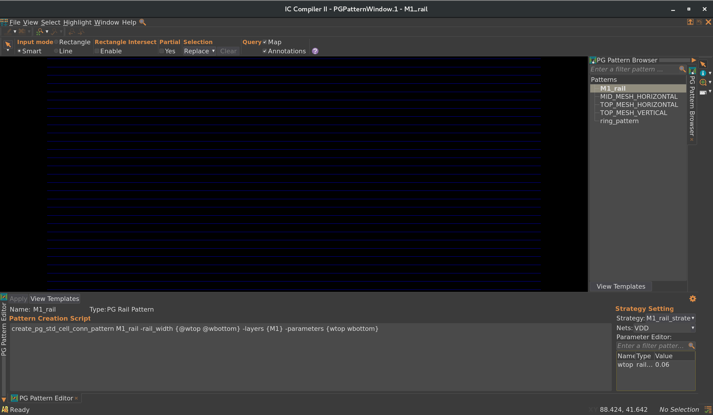

Power ring:
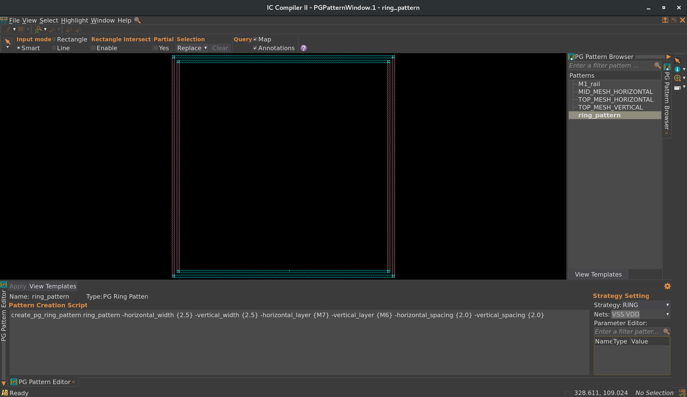

M5 straps:


M6 straps:
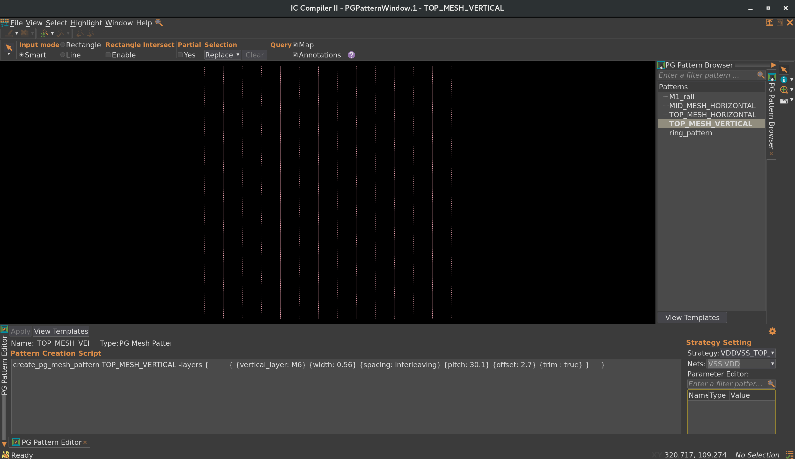

M7 straps:
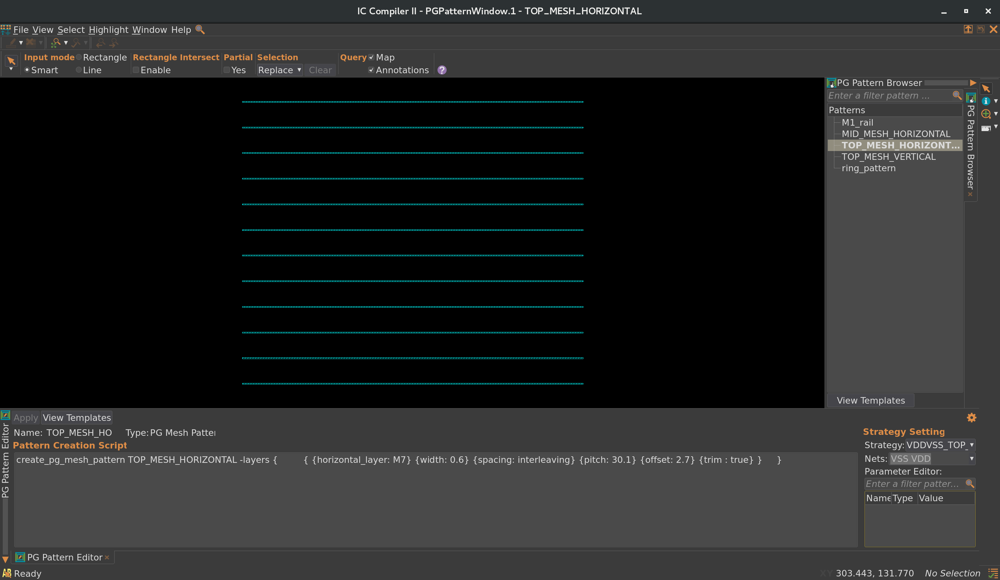

Full grid:
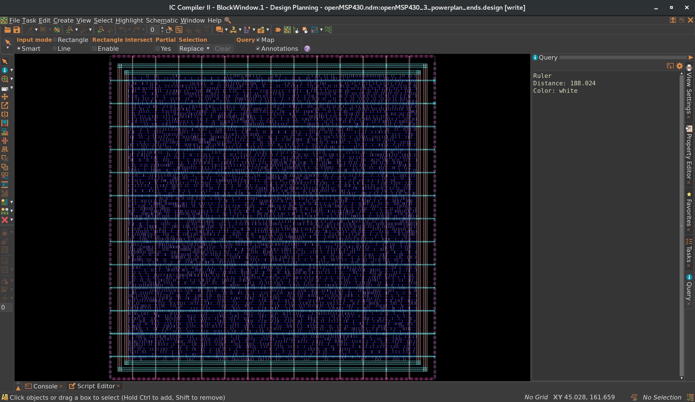

PG patterns and strategies are summarized in `pg_patterns.rpt` and
`pg_strategies.rpt`.

### 4. Placement (`step_4_placement/`)

Opens the Step 3 checkpoint (`openMSP430_3_powerplan_ends` via
`temp_powerplan_ends`), keeps recovery/removal and case-analysis timing
checks enabled, allows coarse placement to continue without scan
definitions (`place.coarse.continue_on_missing_scandef`), sets the
optimizer instance-name prefix to `place`, applies the MCMM setup from
`common/mcmm.tcl`, then runs `place_opt` followed by
`legalize_placement` and saves the `openMSP430_4_place_ends` checkpoint.

Results (`reports/`): `place_legality.rpt` (`check_legality -verbose`)
reports 0 total violations; QoR snapshot
`qor_snapshot/placement.qor` reports 4420 leaf cells, cell area
14894.62, 4876 nets with 0 max-transition/max-capacitance violations,
and 0 total negative slack / 0 violating setup paths in both
`func_slow` and `func_fast` (hold violations remain, e.g. worst hold
-0.04 with 183 `dco_clk` hold violations in `func_fast`); max/min
timing paths are in `timing/placement.max.tim` and
`timing/placement.min.tim`. Library info is in `ndm_lib.rpt`.

Placement:
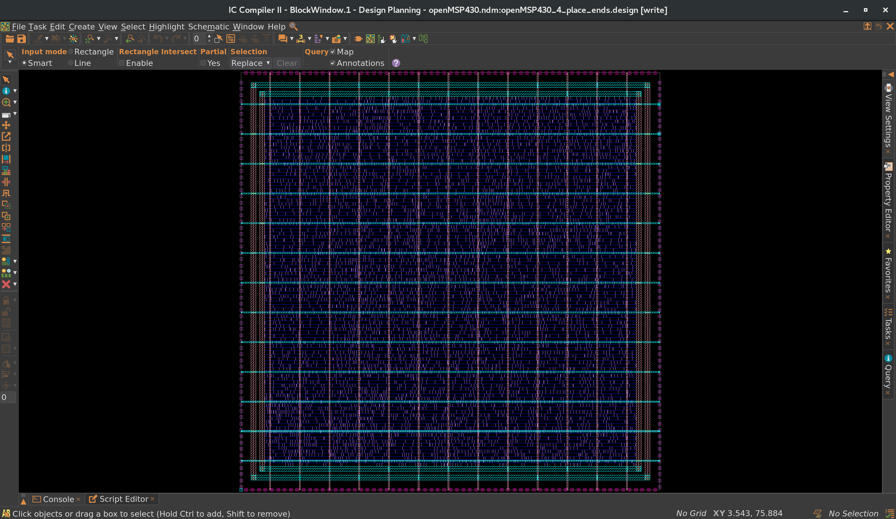

Cell density:
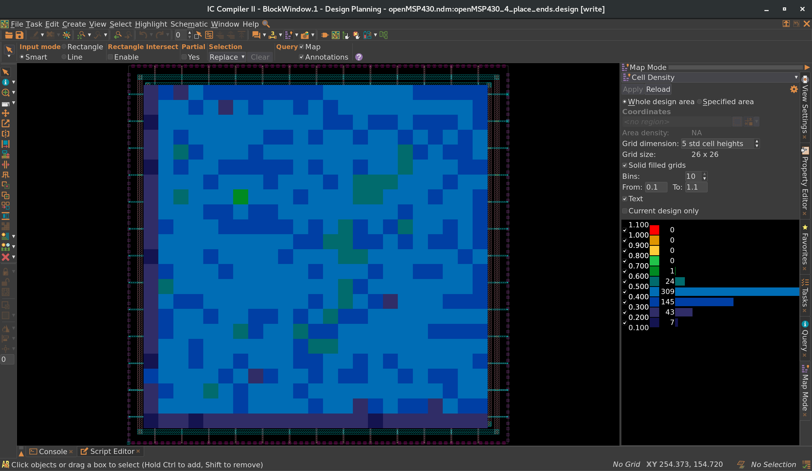

Pin density:
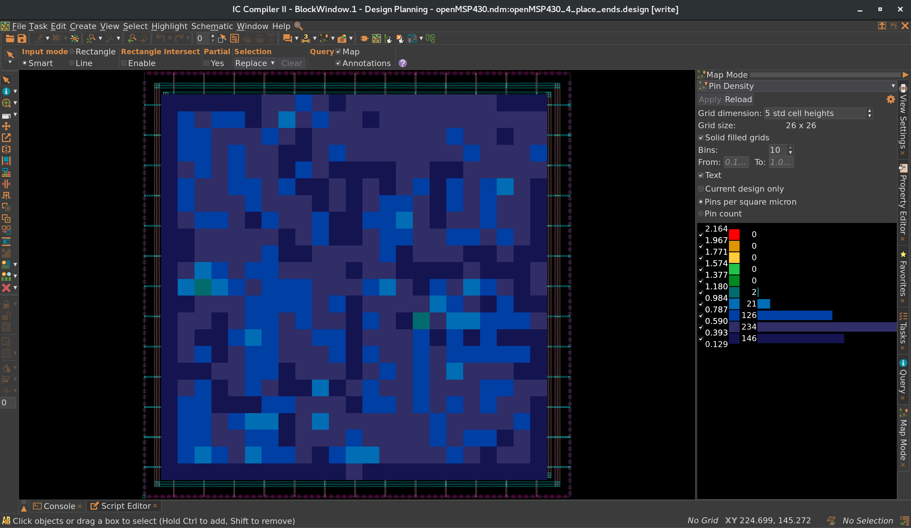

Power density:
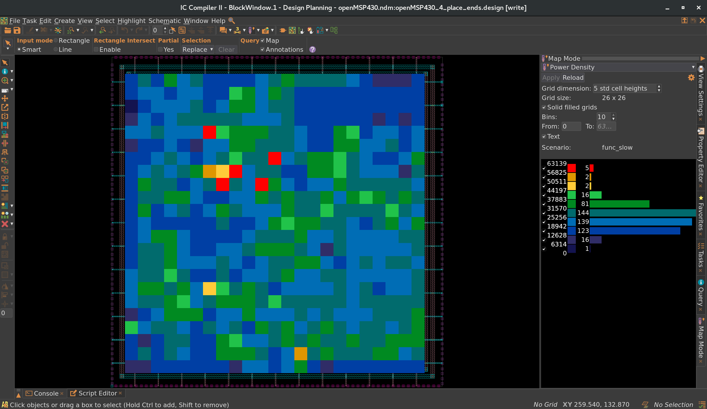

Hierarchical placement:
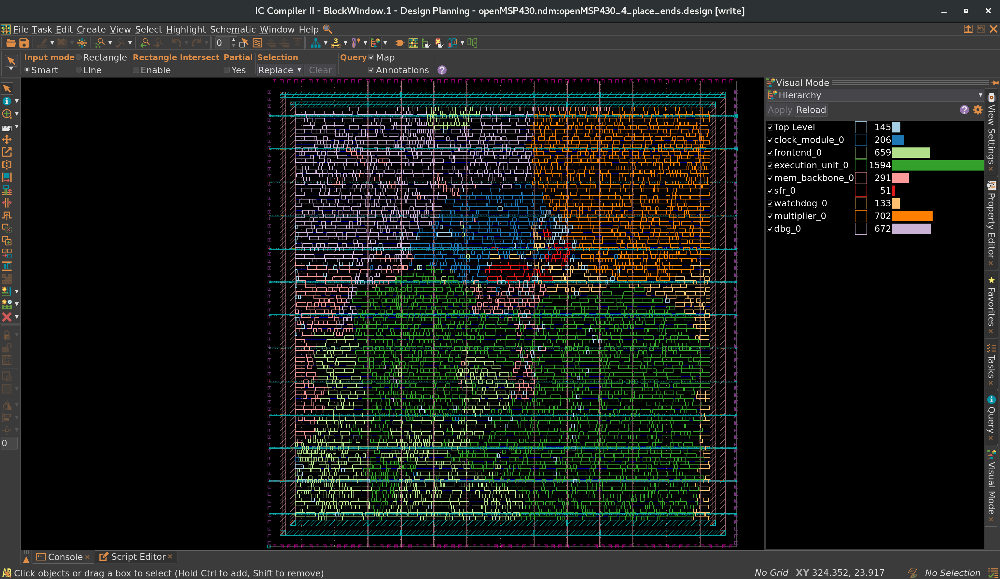

## CTS and Post-CTS Stages

The three stages below are sub-stages of the CTS/post-CTS flow
(top-level Step 5): `step_5_cts` → `step_5_1_cts_hold_fixing` →
`step_5_2_elec_fixing`.

### 5. CTS (`step_5_cts/`)

Opens the Step 4 checkpoint (`openMSP430_4_place_ends` via
`temp_place_ends`), applies the MCMM setup from `common/mcmm.tcl`,
builds the clock tree (`clock_opt -from build_clock -to build_clock`),
then routes it and runs the final optimization (`clock_opt -from
route_clock -to final_opto`) and saves the `openMSP430_5_clock_ends`
checkpoint.

CTS is configured with cell relocation and resizing of pre-existing
cells into the CTS references, Concurrent Clock/Data (CCD) optimization
with high hold effort (`clock_opt.flow.enable_ccd`,
`ccd.hold_control_effort`, `clock_opt.hold.effort`), target skew 0.1
for `dco_clk`/`lfxt_clk`, setup/hold clock uncertainty of 0.2/0.1, an
inverter/buffer CTS reference set, and a `CLK_SPACING` routing rule
(M2–M4) to reduce coupling and crosstalk.

Results (`reports/`): utilization ~0.7615 (`qor_snapshot/clock.util.rpt`),
0 total negative slack / 0 violating setup paths in both `func_slow`
and `func_fast`, with 10 total hold violations remaining at CTS exit;
`clock_tree.rpt` and `clock_timing.rpt` summarize the built trees and
skew, and the clock SDC for the routing stage is written to
`outputs/design.sdc`.

CTS route:
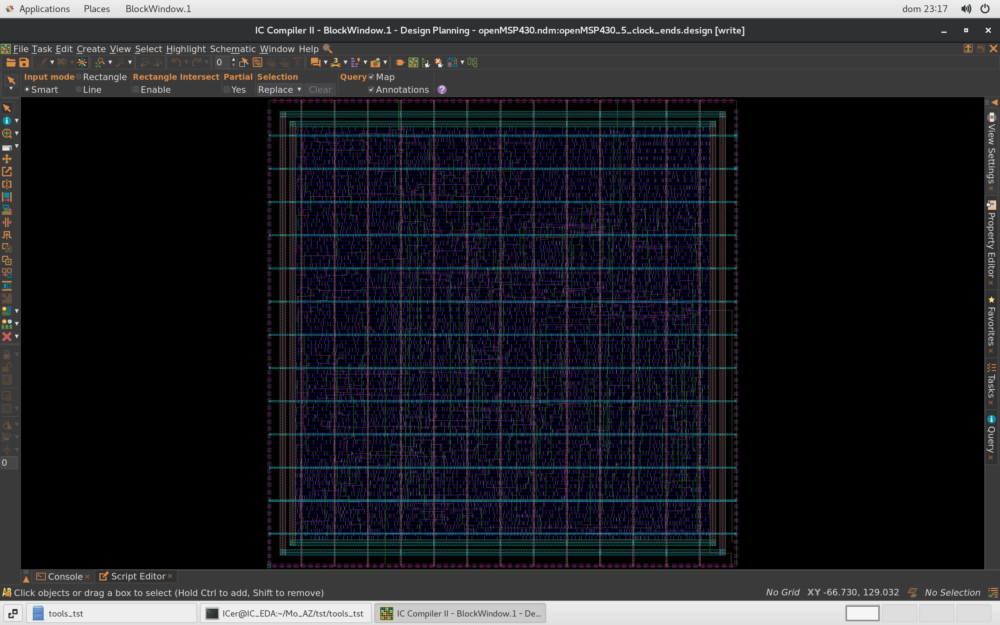

dco_clk tree:
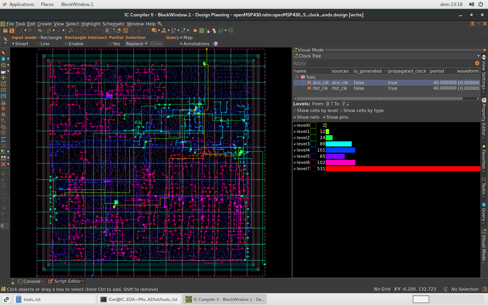

lfxt_clk tree:
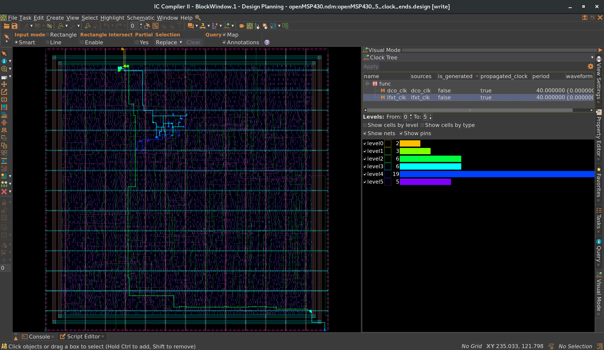

CTS cells dco_clk:
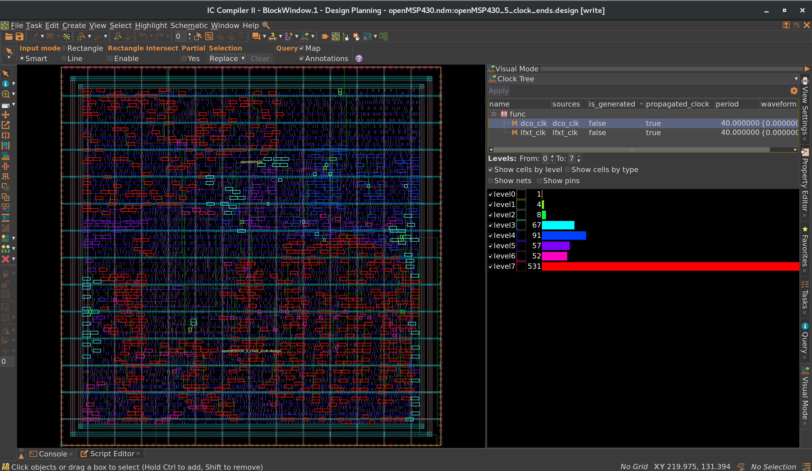

CTS cells lfxt_clk:
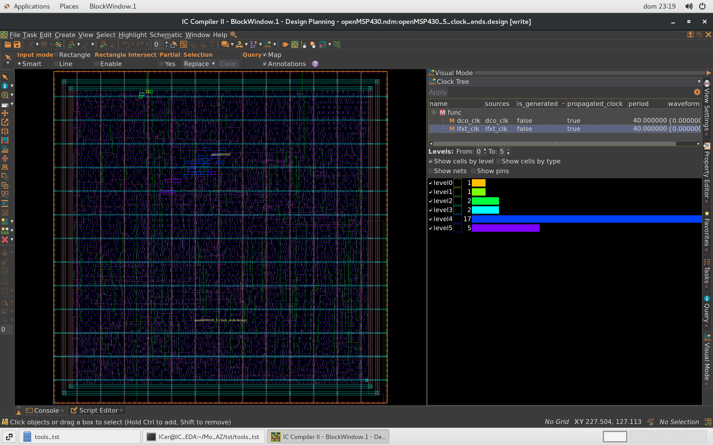

CTS timing:
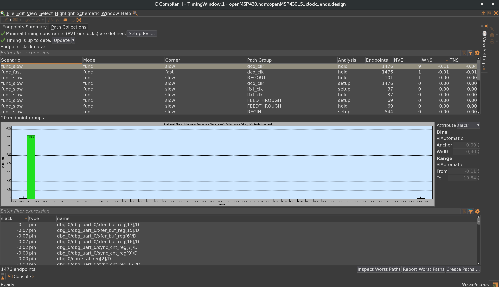

### 5.1. CTS Hold Fixing (`step_5_1_cts_hold_fixing/`)

Opens the Step 5 checkpoint (`openMSP430_5_clock_ends` via
`temp_clock_ends`) and fixes the remaining post-CTS hold violations
with targeted ECO buffer insertion (`hold_fixing.tcl`), followed by
incremental legalization (`legalization.tcl`), and saves the
`openMSP430_5_1_cts_hold_fixing_ends` checkpoint.

Thirteen `insert_buffer` ECO operations were performed using
`NBUFFX2_RVT` and `IBUFFX2_RVT -inverter_pair` cells; the ECO cells
were incrementally legalized (`legalize_placement -incremental`) to
0 legality violations.

Results (`reports/`): 10 hold violations → 0 hold violations with
0 setup violations (`qor_snapshot/post_h_fixing.qor`); the 10
max-capacitance violations from CTS remain
(`qor_snapshot/post_h_fixing.con`). ECO cells and nets are recorded in
`eco_cells_report.rpt` and `eco_nets_report.rpt`, and max/min timing
paths are in `timing/post_h_fixing.max.tim` and
`timing/post_h_fixing.min.tim`.

Hold fixing timing:
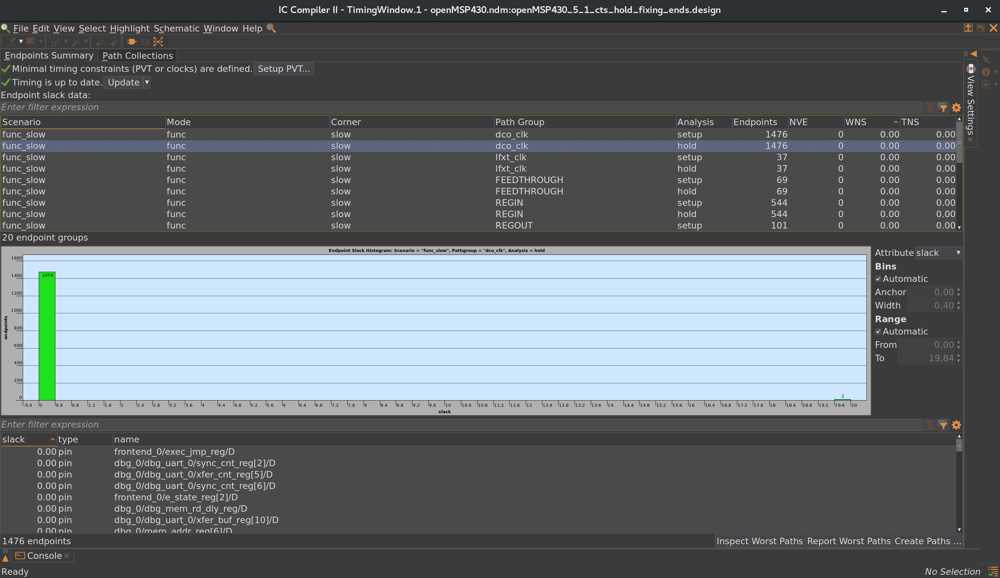

### 5.2. Electrical Fixing (`step_5_2_elec_fixing/`)

Opens the Step 5.1 checkpoint
(`openMSP430_5_1_cts_hold_fixing_ends` via
`temp_cts_hold_fixing_ends`) and fixes max-capacitance /
max-transition electrical violations, distinct from the hold-fixing ECO
stage, and saves the `openMSP430_5_2_elec_fixing_ends` checkpoint.

Baseline (`pre_reports/`): 12 max-capacitance violations and
0 max-transition violations. The fixing strategy (`cap_trans_fix.tcl`)
uses cell upsizing where higher drive-strength cells are available and
buffer insertion where needed, followed by `legalize_placement
-incremental` and max-capacitance / max-transition verification.

Results (`reports/`): 1 max-capacitance violation after fixing
(`constraint_violations_after_fix.rpt`), 0 hold violations and
0 setup violations (`qor_snapshot/elec_fixing.qor`), and 0 legality
violations (`legality_after_fix.rpt`). The remaining violation is
`dbg_clk`, intentionally left unfixed because no higher
drive-strength cell was available; it is expected to resolve with
routed parasitics.

## Routing

The two stages below complete the PNR flow
(top-level Steps 6 ): `step_6_routing` → `step_6_1_elec_fixing`.

### 6. Routing (`step_6_routing/`)

Opens the Step 5.2 checkpoint (`openMSP430_5_2_elec_fixing_ends` via
`temp_elec_fixing_ends`), applies the MCMM setup from `common/mcmm.tcl`,
runs global and detail routing (`route_auto`), then post-route
optimization (`route_opt`), reconnects the PG nets, cleans remaining
DRCs (`optimize_routes`), and saves the `openMSP430_6_complete`
checkpoint.

Checks and reports (`reports/`): in-design LVS (`route_lvs.rpt`),
`op_check_route.rpt`, `op_legality.rpt`, congestion
(`route.congestion.rpt`), constraint violations
(`constraint_violations.rpt`), QoR snapshot (`qor_snapshot/route.*`),
max/min timing (`timing/route.*`), and design summary
(`design_summary.rpt`). The routed netlist for PrimeTime is written to
`outputs/openMSP430_pt.v`.

Routed design:
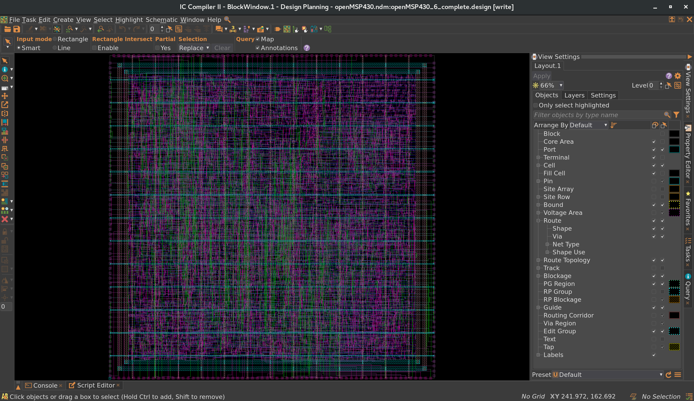

### 6.1. Electrical Fixing (`step_6_1_elec_fixing/`)

Opens the Step 6 checkpoint (`openMSP430_6_complete` via
`temp_complete`) and fixes the post-route max-capacitance /
max-transition electrical violations (`cap_trans_fix.tcl`) using cell
upsizing and buffer insertion, followed by incremental legalization and
ECO routing (`route_eco`, reusing the existing global route), and saves
the `openMSP430_6_1_elec_fixing_ends` checkpoint.

Checks and reports (`reports/`, `pre_reports/`): legality
(`legality_after_fix.rpt`), route check
(`check_route_after_fix.rpt`), max-capacitance / max-transition
(`max_cap_after_fix.rpt`, `max_transition_after_fix.rpt`), constraint
violations (`constraint_violations_after_fix.rpt`), and QoR/timing
snapshots (`qor_snapshot/`, `timing/`).

## Finishing

### 7. Finishing (`step_7_finishing/`)

Opens the Step 6.1 checkpoint (`openMSP430_6_1_elec_fixing_ends` via
`temp_finish_ends`) and performs physical finishing: redundant-via
insertion (excluding cap-sensitive nets), max-capacitance fixes for
violations introduced by via insertion (`cap_fix.tcl`), standard-cell
filler insertion, final PG connection, and saves the
`openMSP430_7_finished` checkpoint.

Final outputs (`outputs/`): gate-level Verilog with PG nets
(`openMSP430_netlist.pg.v`) and without physical-only cells
(`openMSP430_netlist.v`), SDC (`openMSP430.out.sdc`), SPEF
(`openMSP430.out.spef.*`), DEF (`openMSP430.out.def`), and GDS
(`openMSP430.gds`).

Final checks and reports (`reports/`): QoR snapshot (`qor_snapshot/final.*`),
max/min timing (`timing/final.*`), power
(`openMSP430.final_power.rpt`), cell/reference usage
(`openMSP430.final_cell_usage.rpt`,
`openMSP430.final_reference_usage.rpt`), LVS (`openMSP430.lvs.rpt`),
legality (`openMSP430.final_legality.rpt`), PG connectivity
(`openMSP430.final_pg_connectivity.rpt`), constraint violations
(`constraint_violations.rpt`), and crosstalk delta
(`crosstalk_delta.tim`).

Final layout:
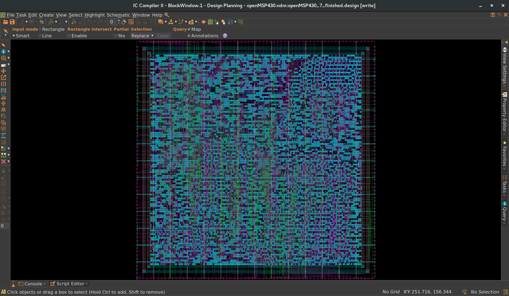

Cell density:
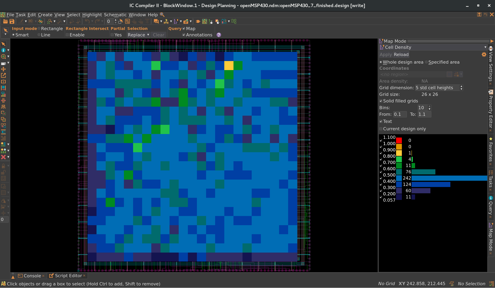

Filler cells:
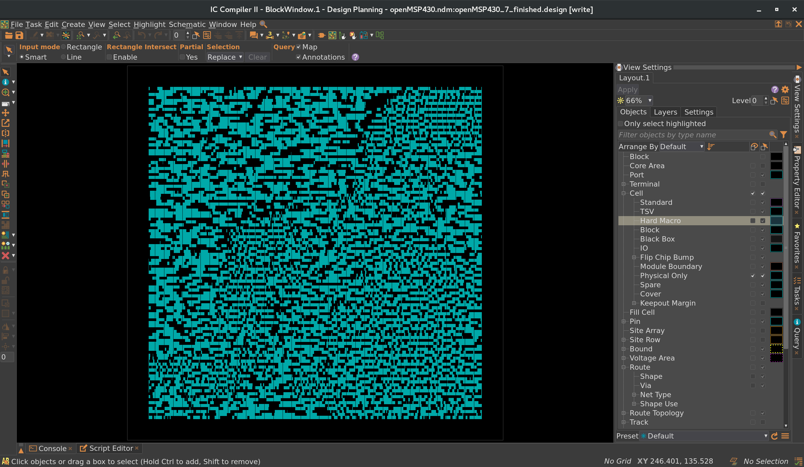

Final timing:
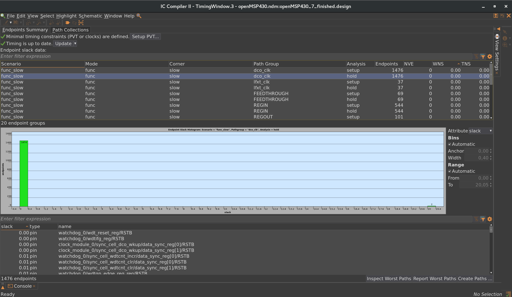


## Directory Organization

Each step follows the same layout:

- `scripts/` — stage driver and implementation (`master.tcl`, stage Tcl,
  `variables.tcl`, `checks.tcl`, `reports.tcl`)
- `reports/` — tool-generated checks and summaries for that stage
- `images/` — layout screenshots
- `run_flow.tcl` at the `pnr/` top level launches the stages in
  sequence via their `master.tcl` drivers (Steps 1–7 are documented above).
