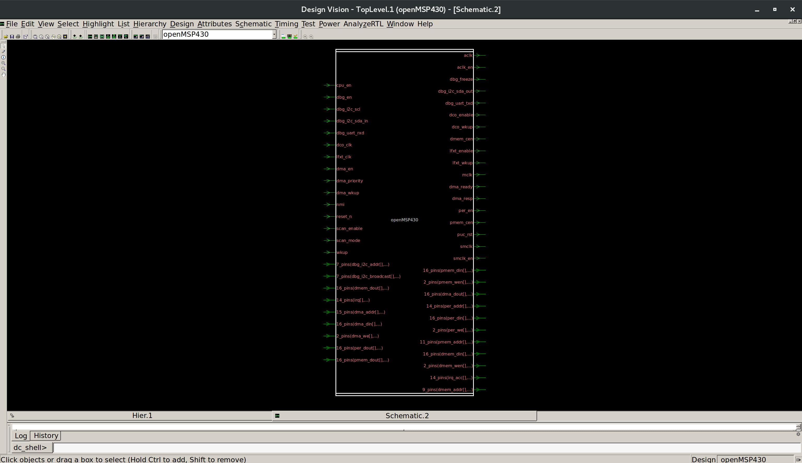
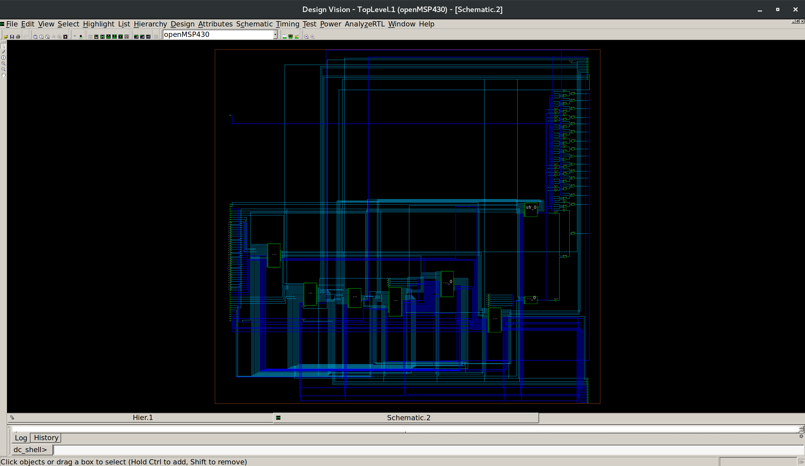

# openMSP430 — RTL Synthesis (`syn/`)

This directory contains the RTL synthesis stage of the openMSP430 ASIC flow using **Synopsys Design Compiler** (`dc_shell`).

It maps the openMSP430 RTL to a technology-mapped gate-level netlist and produces the databases, constraints, and reports required by downstream stages (formality, STA, P&R, simulation).

## Synthesis Flow

Entry point: `run_syn.tcl` → `scripts/master.tcl`

High-level order, as implemented in `scripts/master.tcl`:

1. **Tool / library setup** — `libraries_setup.tcl`: search path, target/link libraries, synthesis tool variables.
2. **RTL reading / elaboration** — `read_design.tcl`: read RTL, set top design, `link` and `check_design`.
3. **Constraint application** — `constraints_setup.tcl`: source SDC constraints and set up path groups.
4. **Synthesis / optimization** — `compile_strategies.tcl`: `compile` with selectable `timing | area | power` strategy, SVF recording enabled in `master.tcl` for Formality.
5. **Report generation** — `reports.tcl` + `check_design` capture in `compile_strategies.tcl`.
6. **Output generation** — `save_outputs.tcl`: `change_names`, then write netlist, DDC, SDC, and SDF.

## Directory Contents

- **`run_syn.tcl`**
  Top-level launcher: runs `scripts/master.tcl` in `dc_shell` and tees the log.
- **`scripts/`**
  Modular synthesis scripts driven in order by `master.tcl`:
  - `master.tcl` — top-level driver and flow order.
  - `variables.tcl` — synthesis directories, `COMPILE_STRATEGY` (default: `timing`), RTL file list, output file names.
  - `libraries_setup.tcl` — search path, target/link libraries, synthesis settings.
  - `read_design.tcl` — RTL read/elaborate, top selection, link/check.
  - `constraints_setup.tcl` — SDC sourcing and path-group setup.
  - `compile_strategies.tcl` — timing/area/power compile selection and `check_design` capture.
  - `reports.tcl` — QoR and design reporting block.
  - `save_outputs.tcl` — netlist/DDC/SDC/SDF writing.
- **`reports/`**
  Design-level reports: summary, hierarchy, cell usage, clocks, constraints, ports, and design checks.
- **`reports/qor/`**
  Quality-of-results reports: area, power, setup timing, hold timing, and overall QoR.
- **`output/`**
  Generated synthesis deliverables for downstream tools.
- **`output/images/`**
  Saved GUI visualization/analysis images of the synthesized design and timing.

## Generated Outputs (`output/`)

- `openMSP430_netlist.v` — gate-level Verilog netlist.
- `openMSP430.ddc` — binary design database for reuse in DC/ICC2.
- `openMSP430.sdf` — Standard Delay Format for back-annotated simulation.
- `openMSP430_output.sdc` — exported constraints for ICC2/PrimeTime.
- `openMSP430_fm.svf` — SVF guidance for Formality RTL-to-netlist equivalence checking.
- `reports/`, `reports/qor/` — text reports listed below.
- `output/images/` — visualization/analysis images.

## Reports

- `openMSP430_design_summary.rpt` — design attributes (`report_design`).
- `openMSP430_hierarchy.rpt` — design hierarchy (`report_hierarchy`).
- `openMSP430_cell_usage.rpt` — library cell instances (`report_cell`).
- `openMSP430_clocks.rpt` — clock definitions and attributes (`report_clock`).
- `openMSP430_constraints.rpt` — constraint violators (`report_constraint -all_violators`).
- `openMSP430_ports.rpt` — port attributes (`report_port`).
- `openMSP430_check_design.rpt` — `check_design` structural checks.
- `qor/openMSP430_area.rpt` — hierarchical area (`report_area -hierarchy`).
- `qor/openMSP430_power.rpt` — hierarchical power (`report_power -hierarchy`).
- `qor/openMSP430_timing_setup.rpt` — max-delay timing, top 10 paths.
- `qor/openMSP430_timing_hold.rpt` — min-delay timing, top 10 paths.
- `qor/openMSP430_qor.rpt` — overall QoR summary (`report_qor`).

### Design Checks / Warnings

`check_design` reports only structural LINT warnings (LINT-2, LINT-8, LINT-28, LINT-29, LINT-31, LINT-32, LINT-33, LINT-52), mainly involving unused or intentionally tied-off signals, direct connections, and constant-driven signals in the existing RTL/hierarchy. These are lint-level observations from `check_design`, not errors. Detailed warning information is preserved in `reports/openMSP430_check_design.rpt`.

## Synthesis Visualization

Top-level module visualization:

Detailed design visualization:

