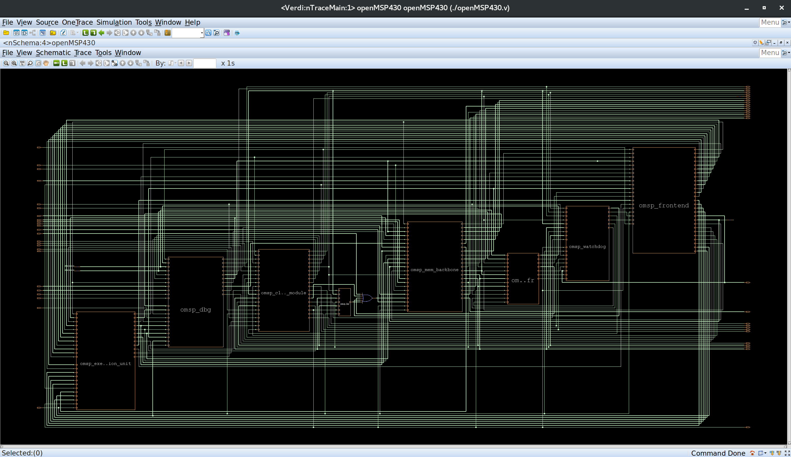
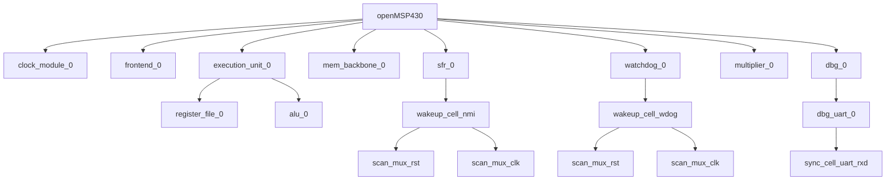

# Verdi RTL Analysis

This folder contains the RTL analysis and structural exploration results generated using **Synopsys Verdi** for the openMSP430 design.

The analysis focuses on understanding the design structure, module hierarchy, interfaces, parameters, and signals without modifying the original RTL.

## Top-Level Schematic

The complete top-level schematic generated in Verdi is shown below:

The `schematic/` directory also contains zoomed-in schematic views of the major blocks visible in the top-level design.

## RTL Hierarchy

The module hierarchy extracted using Verdi's **getModHier** VC App is summarized below. The diagram represents module containment only and does not indicate signal connectivity.

The hierarchy report also contains lower-level implementation instances such as clock-gating cells, synchronization cells, scan multiplexers, and logic cells under the major RTL blocks.

## Analysis Outputs

The folder contains the following Verdi-generated analysis results:

- `modules_hier.log` — Module hierarchy information.
- `modules_params.log` — Module parameter information.
- `topmodule_IO.log` — Top-level module I/O information.
- `All_inst_IO.log` — I/O information for design instances.
- `Modules_Signals.log` — Module signal information.

The `schematic/` directory contains the corresponding schematic views captured during the RTL exploration, including the top-level design and individual major blocks.